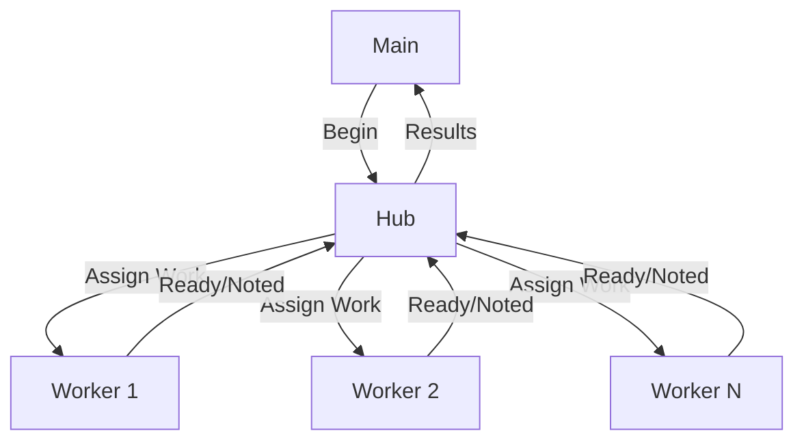

# COP5615 Project 1 (Gleam Implementation)

## Team Members

- **VISHNU SAI PADYALA**  
  - UFID:32712860

## GitHub Repository

[GitHub Link]([https://github.com/your-repo-link](https://github.com/VISHNU07202003/COP5615-Project-1-Gleam-Implementation-))

# Project Description

This project demonstrates distributed task allocation using the **actor model in Gleam**. The program divides a given set of tasks among multiple worker processes. Each worker computes whether the sum of squares in its assigned range is a perfect square. The hub actor manages task distribution, collects results, and coordinates worker termination.

## Overview

The program uses three types of actors: `Hub`, `Worker`, and `Main`.

- The **Hub** is responsible for managing workers, distributing work, and aggregating results.
- The **Workers** compute whether the sum of squares of numbers in their assigned range is a perfect square.
- The **Main** function initializes the hub, creates the workers, and starts computation based on command-line arguments.

## Actors and Functionality

### Hub Actor
- **Purpose**: Central controller that distributes tasks and collects results.
- **Fields**:  
  - `next`: Next task index to assign.  
  - `last`: Upper bound of tasks.  
  - `assigned`: Number of tasks given so far.  
  - `completed`: Number of completed tasks.  
  - `hits`: List of successful starting positions that produced perfect square sums.  
  - `workers`: List of worker subjects.  

- **Messages**:  
  - `Begin(hub, upto, width, pool)`: Start computation with given parameters.  
  - `Noted(start)`: Report a successful result.  
  - `Ready(who)`: Worker signals readiness for more work.  

- **Behavior**:  
  - Spawns workers and assigns them ranges.  
  - Collects results and prints them when all work is done.  
  - Shuts down workers gracefully.  

### Worker Actor
- **Purpose**: Performs computation for a given range.  
- **Messages**:  
  - `Work(start, myself)`: Process range starting at `start`.  
  - `Halt`: Stop execution.  

- **Behavior**:  
  - Computes sum of squares for assigned range.  
  - Checks if result is a perfect square.  
  - Reports successful results back to hub.  
  - Requests more work when finished.  

### Helper Functions
- **`isqrt(n)`**: Integer square root using iterative approximation.  
- **`is_square(n)`**: Checks if a number is a perfect square.  
- **`sumsq_range(a, b)`**: Computes sum of squares between `a` and `b`.  

### Main Function
- Reads command-line arguments:  
  - `n`: Upper bound of tasks.  
  - `k`: Width (size of each work unit).  
  - `pool`: Number of worker processes.  

- Creates hub actor and starts computation.  
- Waits for hub to finish or times out after 60 seconds.  

## Performance
- Parallelism is achieved through multiple workers.  
- Work distribution ensures efficient CPU utilization.  
- Results are aggregated at the hub.  

## Example Usage

Compile and run the program:

```bash
gleam run 10000000 24 8
```

Here:  
- `10000000` → Total range of tasks  
- `24` → Work unit size  
- `8` → Number of workers  

## Example Output

```bash
24
48
72
...
```

If no results are found:  

```bash
none
```

If computation exceeds timeout:  

```bash
timeout
```

## System Diagram

The following diagram shows the interaction between the **Hub** and **Workers** using the actor model:


